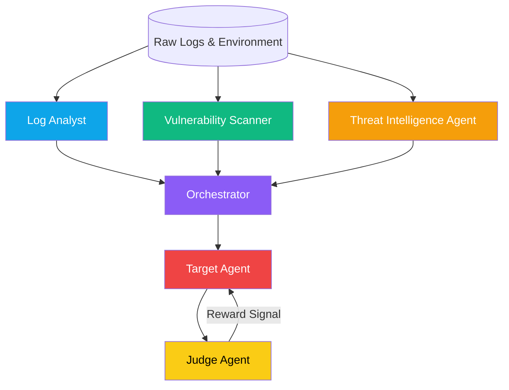
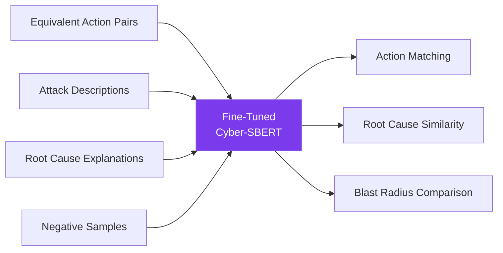
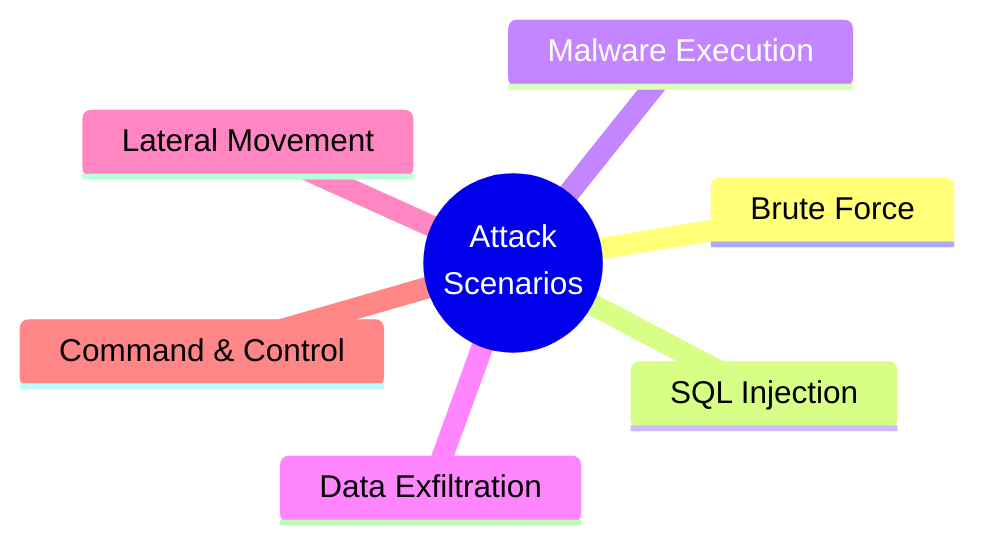
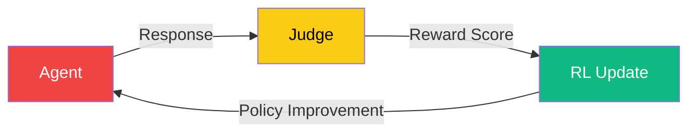
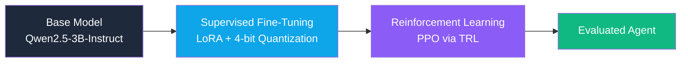
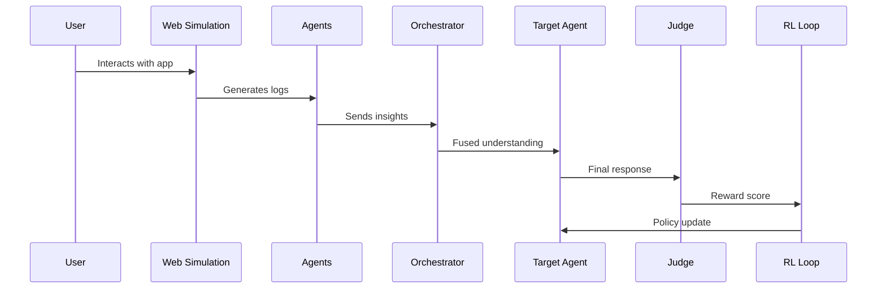
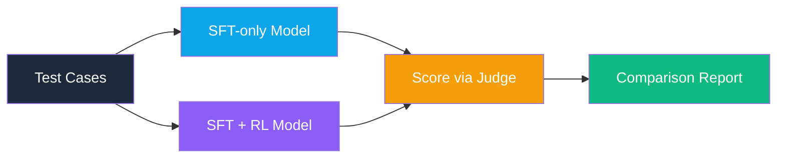

# CyberBench: Building a Self-Improving Multi-Agent Cybersecurity Evaluation System

---

## 1. Introduction

We are **Shaurya Damathia** and **Gitik Raj Jindal**, final-year students from **Thapar Institute of Engineering and Technology**, working as a team under the name **Sci-fi Coders**.

This project started with a simple but important question:

> *If an AI agent suggests actions in a cybersecurity incident… how do we know if it's actually correct?*

With the growing momentum around systems like **Mythos** and AI-driven security workflows, it became clear that the future is not just about building agents — it's about evaluating them reliably in real-world scenarios.

That's where **CyberBench** began.

---

## 2. The Idea

We didn't want to build just another model.
We wanted to build a **system** — one that:

- simulates real cybersecurity incidents
- allows agents to respond
- evaluates those responses deeply
- and continuously improves them

This led to the idea of:

**CyberBench — a self-improving multi-agent cybersecurity evaluation platform**

---

## 3. System Overview

CyberBench is designed as a **closed-loop system**:


It combines:

- realistic simulation
- structured reasoning
- semantic evaluation
- reinforcement learning

into one unified framework.

---

## 4. Multi-Agent Architecture

At the core of CyberBench is a **six-agent system**, where each agent has a clearly defined role.



**Log Analyst** — Processes raw logs, identifies anomalies, extracts IOCs, and builds an attack timeline.

**Vulnerability Scanner** — Analyzes infrastructure and dependencies to detect vulnerabilities and potential CVEs.

**Threat Intelligence Agent** — Enriches findings with known threat patterns, MITRE mappings, and IOC validation.

**Orchestrator** — Combines outputs from all agents, resolves conflicts, and creates a unified understanding of the incident.

**Target Agent** — Generates the final response — including mitigation steps, root cause analysis, and recommendations.

**Judge Agent** — Evaluates the response using multiple dimensions:

- accuracy
- completeness
- actionability
- technical depth
- relevance

---

## 5. Evaluation Pipeline

The system runs through a structured pipeline:


Each stage is **modular and observable**, making the system both scalable and explainable.

---

## 6. Custom SBERT Model

One of the most important insights came during our research phase.

Initially, we used standard SBERT models for semantic comparison. However, we observed that:

- semantically identical cybersecurity actions were not scoring highly
- unrelated technical phrases sometimes showed misleading similarity

For example:

> *"Block attacker IP"* ≡ *"Add IP to firewall deny list"*

These should be treated as identical — but generic models struggled.

### Our Observation
Off-the-shelf SBERT models were not capturing cybersecurity-specific semantics accurately, which made evaluation unreliable.

### Our Approach
To solve this, we **fine-tuned SBERT** on a cybersecurity-focused dataset, including:

- equivalent action pairs
- varied attack descriptions
- root cause explanations
- negative (non-related) samples



This allowed the model to:

- understand domain-specific terminology
- correctly match similar actions
- improve evaluation precision

### Usage
The custom SBERT model is used for:

- action matching
- root cause similarity
- blast radius comparison

---

## 7. Dataset Design

Each scenario in CyberBench is **structured and realistic**.

It includes:

- logs (authentication, system, network)
- environment details (assets, services, configurations)
- ground truth (attack type, IOCs, expected response)

We designed scenarios to cover multiple real-world attack categories:



Each scenario is paired with an **8-section ground truth response** covering:

1. What Happened
2. Current Risk
3. Immediate Actions
4. Investigation Steps
5. Remediation
6. Hardening
7. Risk Score
8. Assumptions

The dataset contains **54 synthetic cases** (9 variants × 6 attack templates), split 80/10/10 across train, eval, and test sets.

---

## 8. Reinforcement Learning Loop

CyberBench is not just an evaluation system — it is a **self-improving system**.

We implemented a reinforcement learning loop where:

- the agent generates a response
- the judge evaluates it
- a reward score is computed
- the model improves over time



### Reward Dimensions
The reward function considers six weighted dimensions:

| Dimension | Weight | What It Measures |
|---|---|---|
| Accuracy | 0.25 | MITRE technique ID overlap (Jaccard) |
| Completeness | 0.20 | Presence of all 8 required response sections |
| Actionability | 0.20 | Quality and specificity of immediate actions |
| Technical Depth | 0.15 | CVE references, tools, forensic detail |
| MITRE Alignment | 0.10 | Correct use of ATT&CK technique IDs |
| Relevance | 0.10 | Root cause and blast radius coverage |

### Reward Shaping
Rewards are shaped around a baseline of 50.0 with a scale of 0.01. A streak bonus of +0.05 per consecutive improvement (capped at +0.25) encourages sustained progress. Verdicts are issued as **pass** (≥75), **partial** (≥45), or **fail** (<45).

### Training Flow
This allows the system to **continuously refine** its performance.

---

## 9. Training Pipeline — SFT + RL

CyberBench trains the Target Agent in two phases:



### Phase 1 — Supervised Fine-Tuning (SFT)

We fine-tune **Qwen/Qwen2.5-3B-Instruct** using LoRA/PEFT on the cybersecurity incident-response dataset.

Key configuration:
- **Quantization**: 4-bit NF4 via bitsandbytes (~1.5 GB VRAM)
- **LoRA**: rank=32, alpha=64, targeting all attention + MLP projection layers
- **Trainable parameters**: ~25M out of 3B total (~0.8%)
- **Epochs**: 2 with cosine LR scheduling and 10% warmup
- **Max sequence length**: 1024 tokens

### Phase 2 — Reinforcement Learning (PPO)

We further optimize the SFT model using TRL's PPO trainer with the Judge's reward signal.

Key configuration:
- **Learning rate**: 1e-5 (small, to preserve SFT knowledge)
- **PPO epochs**: 2 per batch
- **KL coefficient**: 0.05 (keeps policy close to SFT baseline)
- **Max new tokens**: 512 per generation

---

## 10. OpenEnv Integration

CyberBench acts as a **world model** where external agents can:

- interact with simulated environments
- generate responses
- receive structured feedback
- improve through evaluation

This makes it compatible with modern agent evaluation frameworks.

---

## 11. Web Simulation Interface

To make the system realistic, we built an **interactive web interface**.

Instead of static inputs:

- users interact with a normal application
- their actions generate logs
- attacks emerge naturally

For example:

| User Behavior | Detected Attack |
|---|---|
| Repeated login failures | Brute Force |
| Malicious search queries | SQL Injection |
| Rapid file access | Data Exfiltration |
| Suspicious uploads | Malware Execution |

This creates a real **SOC-like experience**, where behavior drives detection.

---

## 12. End-to-End Workflow



1. User interaction generates logs
2. Logs are processed by agents
3. Insights are fused by the orchestrator
4. Target agent produces response
5. Judge evaluates it
6. RL loop improves the system

---

## 13. Evaluation Results

We evaluate both the SFT-only and RL-trained models on held-out test cases across all six reward dimensions.



The evaluation compares both models on:

- **Per-dimension scores** (accuracy, completeness, actionability, technical depth, MITRE alignment, relevance)
- **Overall weighted score** (0–100)
- **Shaped reward** (baseline-centered)
- **Structural completeness** (sections present out of 8)
- **Technical specificity** (CVE references, MITRE technique IDs, word count)
- **Verdict distribution** (pass / partial / fail)

Results are saved to `submission_package/eval_results.json` and visualized as grouped bar charts and radar overlays.

---

## 14. Repository Structure

```
final_meta_hack/
├── agents/                     # Multi-agent pipeline
│   ├── log_analyst.py          # Log classification, IOC extraction, attack staging
│   ├── threat_intel.py         # MITRE ATT&CK mapping and IOC enrichment
│   ├── vuln_scanner.py         # CVE detection against network assets
│   ├── orchestrator.py         # Unified briefing synthesis
│   ├── target_agent.py         # Groq-based incident response (Part 1 / UI)
│   ├── judge.py                # Multi-dimension response scoring (SBERT + Groq)
│   └── utils.py                # Shared Groq async client
├── pipeline/                   # Orchestration & metrics
│   ├── runner.py               # 10-stage pipeline executor
│   ├── case_selector.py        # Weighted random scenario selection
│   ├── env_loader.py           # Case environment builder
│   ├── semantic.py             # Fine-tuned SBERT similarity scorer
│   └── metrics.py              # Score computation + leaderboard persistence
├── server/                     # FastAPI REST backend
│   └── main.py                 # /api/pipeline/trigger, /api/leaderboard, /api/rl/*
├── rl/                         # RL self-improvement loop
│   ├── environment.py          # Episode environment wrapper
│   ├── reward.py               # 6-dimension reward shaper
│   ├── experience_buffer.py    # Replay buffer
│   └── trainer.py              # RL training loop
├── qwen_training/              # Part 2 — Local Qwen2.5-3B training
│   ├── qwen_target_agent.py    # Drop-in Qwen agent (4-bit NF4 + LoRA)
│   ├── data_collector.py       # Episode collection (Groq briefing + Qwen + Judge)
│   ├── rft_trainer.py          # Rejection-Sampling Fine-Tuning loop
│   ├── run_training.py         # CLI entry point
│   └── verify_training.py      # CPU-safe end-to-end training verification
├── sbert/                      # Domain-specific SBERT fine-tuning
│   ├── train.py                # Fine-tunes all-MiniLM-L6-v2 on cyber pairs
│   ├── corpus/cyber_pairs.json # 25 positive + negative sentence pairs
│   └── download_model.py       # Downloads base model from HuggingFace
├── cyberbench_env/             # OpenEnv environment wrapper
├── data/
│   └── scenarios.json          # 10 structured cybersecurity incident scenarios
├── web/                        # Next.js 15 SOC dashboard (Part 1 UI)
│   └── src/app/                # Dashboard / Pipeline / RL / Leaderboard / Cases
├── cyberbench_pipeline.ipynb   # Colab notebook — Qwen2.5-3B RFT training
├── colab_training.ipynb        # Colab notebook — simplified training walkthrough
├── app.py                      # Gradio app for HuggingFace Spaces
├── Dockerfile                  # HuggingFace Spaces Docker config
├── requirements.txt            # Core Python dependencies
├── requirements_hf.txt         # HuggingFace Spaces dependencies
└── .env.example                # API key template
```

---

## 15. Quick Start

### Part 1 — Groq UI Pipeline

```bash
# 1. Clone and install
git clone https://github.com/gitikraj/final_meta_hack.git
cd final_meta_hack
pip install -r requirements.txt

# 2. Configure keys
cp .env.example .env
# Edit .env and add your GROQ_API_KEY

# 3. Train SBERT judge (first time only, ~2 min)
python sbert/train.py

# 4. Start backend
python -m uvicorn server.main:app --port 8000

# 5. Start frontend (in a new terminal)
cd web && npm install && npm run dev
# Open http://localhost:3000
```

### Part 2 — Qwen2.5-3B Training (Google Colab)

1. Open `cyberbench_pipeline.ipynb` in [Google Colab](https://colab.research.google.com/)
2. Set runtime to **T4 GPU** (Runtime → Change runtime type)
3. Add `GROQ_API_KEY` to Colab secrets (key icon in left panel)
4. Run all cells — training completes in ~45 min

### HuggingFace Spaces

```bash
# Deploy the Gradio app
# Set GROQ_API_KEY and HF_ADAPTER_REPO as Space secrets
# Push to your HF Space — Dockerfile handles the rest
```

---

## 15. Conclusion

CyberBench represents a **shift in how AI systems are evaluated in cybersecurity**.

Instead of static benchmarks, it provides:

- dynamic simulation
- structured multi-agent reasoning
- domain-aware semantic evaluation
- continuous learning through reinforcement

As AI continues to play a larger role in security, systems like CyberBench can help ensure that these agents are not just intelligent — but also **reliable, accurate, and effective** in real-world scenarios.

---

## Final Note

This project reflects our approach as **Sci-fi Coders**:

> *not just building models — but building systems that behave like the real world.*

---

